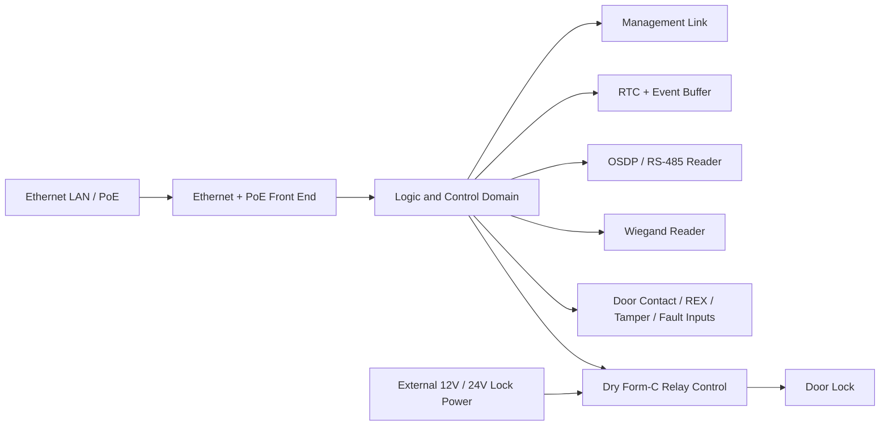

# maple-tscircuit

TypeScript/TSX hardware design project built with tscircuit.

[](https://www.typescriptlang.org/)
[](https://docs.tscircuit.com/)
[](./specs/001-door-access-controller/plan.md)
[](./specs/001-door-access-controller/spec.md)

Repository ini diarahkan untuk merancang one-door access controller berbasis LAN dengan pendekatan modern, typed, dan reviewable. Fokusnya bukan membuat clone vendor tertentu, tetapi membangun desain orisinal dalam kelas produk yang sama dengan controller seperti ZKTeco C3 atau Verkada AC12.

## Architecture Snapshot



## Overview

Target board yang sedang dirancang mencakup:

- Ethernet untuk komunikasi data dan manajemen
- PoE untuk logic dan networking domain
- external lock power 12V/24V yang terpisah dari PoE domain
- dry relay output untuk fail-safe dan fail-secure lock
- dukungan reader OSDP/RS-485 dan Wiegand
- door contact, request-to-exit, tamper, dan fault monitoring
- local fallback dan event buffering saat koneksi ke sistem pusat terganggu

Seluruh arah desain saat ini diturunkan dari dokumen feature di `specs/001-door-access-controller/`.

## Why This Repo Exists

Project ini dipakai untuk memodelkan controller hardware sebagai code, sehingga:

- intent elektrikal lebih mudah direview
- net, footprint, dan interface bisa ditelusuri secara eksplisit
- iterasi desain bisa divalidasi lewat workflow `tsci`
- struktur circuit bisa dipecah menjadi subcircuit yang reusable

## Current Status

Status repo saat ini masih di fase awal implementasi:

- board entrypoint di `index.circuit.tsx` masih sederhana
- feature specification, research, plan, contracts, dan task breakdown sudah tersedia
- workflow repo sudah dimigrasikan ke struktur Copilot-native di `.github/`

Artinya, dokumentasi desain sudah cukup matang, tetapi implementasi circuit utama masih akan berkembang mengikuti plan dan task yang ada.

## Feature Direction

Keputusan desain yang sudah diambil untuk feature utama saat ini:

| Area | Direction |
| --- | --- |
| Network | 10/100 Ethernet |
| Power | PoE untuk logic/network, lock power eksternal |
| Lock output | Dry Form-C relay |
| Lock mode | Fail-safe dan fail-secure |
| Reader | OSDP/RS-485 dan Wiegand |
| Offline behavior | Local fallback + buffered events |
| Design style | Pure TSX subcircuits + strict TypeScript |

## Quick Start

### 1. Install dependencies

```bash
npm install
```

### 2. Run the interactive preview

```bash
npm run dev
```

### 3. Type-check the project

```bash
npm run typecheck
```

### 4. Build the circuit

```bash
npm run build
```

### 5. Generate snapshots

```bash
npm run snapshot
```

Update snapshots when needed:

```bash
npm run snapshot:update
```

## What You Will Find Here

- `index.circuit.tsx` sebagai entrypoint circuit saat ini
- dokumen desain lengkap untuk feature controller satu pintu
- workflow validasi berbasis `tsci`
- struktur repo yang siap dipecah menjadi subcircuit per domain elektrikal

## Recommended Validation Flow

Untuk perubahan circuit yang bermakna, jalankan:

```bash
npm run typecheck
tsci check netlist
tsci build
tsci snapshot
```

Tambahkan placement check bila ada perubahan outline, konektor, footprint, atau zonasi board:

```bash
tsci check placement
```

## Project Structure

```text
.
├── index.circuit.tsx
├── package.json
├── tscircuit.config.json
├── tsconfig.json
├── .github/
│   ├── copilot-instructions.md
│   └── skills/tscircuit/
└── specs/
    └── 001-door-access-controller/
```

Dokumen yang paling relevan untuk memahami arah project:

- `specs/001-door-access-controller/spec.md`
- `specs/001-door-access-controller/research.md`
- `specs/001-door-access-controller/plan.md`
- `specs/001-door-access-controller/tasks.md`

## Design Documents

Jika ingin memahami project dari level requirement ke implementasi, urutannya adalah:

1. `spec.md` untuk ruang lingkup dan kebutuhan sistem
2. `research.md` untuk keputusan arsitektur utama
3. `plan.md` untuk bentuk implementasi teknis
4. `tasks.md` untuk urutan eksekusi pekerjaan

## Planned Implementation Layout

Struktur implementasi yang direncanakan untuk feature utama:

```text
src/
├── circuits/
│   └── one-door-controller.tsx
├── components/
│   ├── ethernet-poe-front-end.tsx
│   ├── power-domains.tsx
│   ├── reader-interfaces.tsx
│   ├── supervised-input-bank.tsx
│   └── relay-lock-output.tsx
└── lib/
    ├── controller-types.ts
    └── wiring-contracts.ts
```

Tujuan pemecahan ini adalah menjaga circuit tetap modular, typed, dan mudah direview per domain elektrikal.

## Development Stack

- TypeScript 5.x
- TSX dengan `strict: true`
- `tscircuit`
- `tsci` CLI

Script yang tersedia di repo:

| Command | Purpose |
| --- | --- |
| `npm run dev` | Preview interaktif circuit |
| `npm run build` | Build circuit |
| `npm run typecheck` | Type checking tanpa emit |
| `npm run snapshot` | Generate snapshot |
| `npm run snapshot:update` | Update snapshot baseline |

## Engineering Notes

- Gunakan nama net yang eksplisit dan konsisten.
- Jangan menebak footprint final tanpa penanda bahwa part masih provisional.
- Pisahkan intent logic/network power dari lock power.
- Utamakan subcircuit reusable dibanding board file monolitik.
- Jangan klaim fabrication-ready sebelum validation flow dan review artifacts lengkap.

## Roadmap

Tahap implementasi yang direncanakan saat ini:

1. Menyiapkan shared types, wiring contracts, dan board shell
2. Menambahkan Ethernet + PoE front end dan power domains
3. Menambahkan relay lock output, door contact, dan REX path
4. Menambahkan OSDP/RS-485 dan Wiegand reader interfaces
5. Menambahkan local buffering, RTC-backed ordering, dan managed administration hooks
6. Menyelesaikan review artifacts dan validasi desain

## Disclaimer

Repository ini menggunakan riset capability-level dari produk sekelas access controller komersial, tetapi tidak dimaksudkan untuk menyalin atau mereproduksi skematik proprietary vendor. Semua keputusan implementasi diarahkan ke desain asli yang bisa direview dan divalidasi di dalam repo ini.
